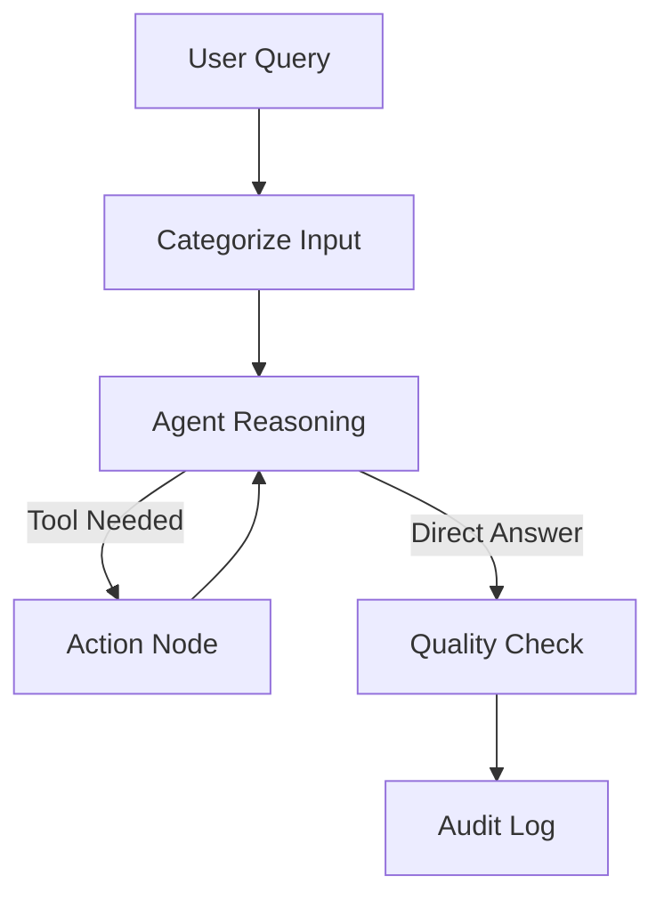

# Agentic Travel Compliance Assistant

## 1. Project Description

This project implements an agentic, retrieval-augmented assistant for corporate travel compliance and expense support. The system helps employees answer policy-related questions, check reimbursement rules, and perform currency conversions through a modular LangGraph workflow powered by a local LLM and a vector database.

This project is a production-oriented implementation combining reasoning, tool use, and retrieval. It is built around a Streamlit frontend, a LangGraph orchestration layer, a dedicated RAG subgraph, and a local Ollama-based LLM runtime.

---

## 2. Problem Statement & Use Case Justification

**The Problem: Travel & Expense Compliance**

Corporate travel policies are dense, context-dependent, and frequently updated. Employees often struggle to apply general rules to their specific, multi-currency travel scenarios. Traditional keyword searches and static FAQs are insufficient because they cannot handle queries requiring both document comprehension and dynamic calculation. 

**The Solution**

This project implements a conversational assistant to streamline compliance by:
- Grounding policy answers in retrieved official documents.
- Performing live currency conversions for accurate expense reporting.
- Enforcing content safety and quality through automated workflow guardrails.

**Architectural Justification: Why Agentic RAG?**

A standard RAG pipeline fails when a query requires multi-step reasoning (e.g., *"Is this expense reimbursable, and what is the equivalent amount in EUR?"*). An agentic architecture is necessary here because:
- **Autonomous Routing:** The system dynamically evaluates the context to decide whether to query the vector DB, call a finance API, or generate a direct response.
- **Tool Interoperability:** It seamlessly combines semantic search (unstructured data) with deterministic tool execution (structured calculation).
- **Stateful Reasoning:** Using LangGraph, the agent maintains conversation context and self-corrects, providing a much more robust solution for complex administrative workflows.

---

## 3. Architecture & Agentic Workflow

### High-level architecture

The system follows a modular agent architecture built around three main layers:

1. Frontend layer: Streamlit-based conversational interface.
2. Agent orchestration layer: LangGraph workflow that manages reasoning, routing, tool execution, and QA.
3. Knowledge and tool layer: Chroma vector database for policy retrieval, Ollama for local LLM inference, and external finance tool integration.

### Main LangGraph workflow

The main graph is implemented in [src/agent.py](src/agent.py) and consists of five core nodes:

- Node 1: Categorize Input
  - The assistant first analyzes the user request and assigns semantic categories such as Travel Policy, Finance, or General.
  - This step provides routing metadata and helps the agent understand the intent of the request.

- Node 2: Agent Reasoning
  - The LLM decides whether the request should be answered directly or delegated to a tool.
  - Tool binding is performed dynamically so the agent can choose the most relevant operation.

- Node 3: Action Node
  - This node executes the selected tool call using LangGraph’s ToolNode.
  - In this implementation, the system uses the policy search tool and the currency conversion tool.

- Node 4: Quality Check
  - Before finalizing the response, the system evaluates whether the output is helpful and safe.
  - This acts as a lightweight guardrail for content quality.

- Node 5: Audit Log
  - The workflow completes by saving metadata about the interaction and the compliance outcome.



### Conditional routing and state management

The workflow uses a stateful LangGraph graph with a typed state object that carries:

- the conversation history,
- extracted categories,
- approval status,
- audit metadata.

The system uses LangGraph’s message accumulation pattern so that the agent can reason over the full conversation context rather than only the latest user message. Conditional edges allow autonomous routing:

- if the LLM decides to call a tool, execution moves to the Action Node,
- otherwise, the workflow proceeds to the quality-check stage and then to completion.

The stateful LangGraph implementation allows dynamic tool selection rather than static retrieval.

### RAG subgraph design

The RAG component is isolated into a dedicated subgraph implemented in [src/rag_subgraph.py](src/rag_subgraph.py). This makes the retrieval pipeline modular and reusable.

The subgraph contains:

- Retrieve Docs: loads the relevant policy chunks from Chroma using a retriever,
- Generate RAG Answer: passes the retrieved evidence to the local LLM and produces a grounded answer.

This modular separation is important because it allows the main agent workflow to remain focused on orchestration, while the retrieval logic can be improved or replaced independently.

### Tools integrated

The system currently integrates the following tools:

1. Policy Search Tool
   - Executes the RAG subgraph over the corporate travel policy corpus.
   - Used whenever a user asks about travel rules, allowances, or reimbursement eligibility.

2. Currency Conversion Tool
   - Calls the Frankfurter API for historical or latest exchange rates.
   - Used for finance-related queries and expenses in different currencies.

### Data source

The knowledge base is built from the corporate travel policy PDF stored in [data/FM-MMR-Corporate-Travel-and-Expense-Policy-4-14.pdf](data/FM-MMR-Corporate-Travel-and-Expense-Policy-4-14.pdf). The PDF is chunked, embedded, and stored locally in Chroma for semantic retrieval.

However, the ingestion pipeline is designed to process an entire directory of documents. It automatically attaches `source_file` metadata to each chunk, ensuring accurate semantic retrieval and traceability even when scaling to a multi-document corpus.

### Model choice and trade-offs

The project uses a local Llama 3.2 3B model via Ollama, with sentence-transformers embeddings for retrieval. This choice was made for several reasons:

- lower cost than relying on paid LLM APIs,
- better privacy control for sensitive corporate data,
- suitability for an academic or lightweight deployment environment,
- compatibility with local development and Docker-based deployment.

However, using a small (3B parameter) local model comes with noticeable trade-offs compared to commercial APIs:

- **Latency:** Local inference is considerably slower, especially under concurrent load.
- **Tool-calling reliability:** The model occasionally struggles with complex agentic reasoning, sometimes "hallucinating" by outputting raw tool-call JSON directly to the user instead of executing the required tool.
- **Instruction following:** It has a harder time strictly adhering to expected output formats and complex system prompts.

These known limitations directly influenced the architecture (e.g., adding a Quality Check node) and are further detailed in the evaluation section.


---

## 4. Technical Implementation & UI

### Backend implementation

The application is implemented in Python and uses a modern LLM application stack:

- LangGraph for workflow orchestration,
- LangChain for tool and model integration,
- Ollama for local LLM inference,
- Chroma as the vector database,
- Hugging Face embeddings for semantic retrieval,
- Streamlit for the user interface.

### Knowledge ingestion pipeline

The vector database is initialized from PDF documents stored in the data folder. The ingestion pipeline:

- loads PDF pages,
- splits them into chunks,
- stores metadata such as source file and page number,
- persists embeddings locally for efficient similarity search.

This design supports incremental updates and avoids rebuilding the full database on every run.

### User interface

The UI is a Streamlit application implemented in [src/app.py](src/app.py). It provides:

- a chat-based interface for user questions,
- a control panel with evaluation-case selection,
- a simple session-based interaction flow,
- support for running predefined test prompts from [tests/test_queries.json](tests/test_queries.json) as interactive UI smoke tests.

This distinction is important: [tests/test_queries.json](tests/test_queries.json) is intended for quick manual validation of the user experience and routing behavior, while [tests/load_tests.py](tests/load_tests.py) is used to measure latency, stability, and throughput under repeated requests.

The Streamlit UI serves as a lightweight prototype. It provides a simple chat interface while the backend handles the complex routing, retrieval, and tool execution.

### Project structure

- [src/agent.py](src/agent.py): main LangGraph workflow
- [src/rag_subgraph.py](src/rag_subgraph.py): modular RAG subgraph
- [src/database.py](src/database.py): vector DB initialization and retriever setup
- [src/currency_converter_tool.py](src/currency_converter_tool.py): finance tool integration
- [src/app.py](src/app.py): Streamlit frontend
- [tests/test_queries.json](tests/test_queries.json): functional evaluation prompts
- [tests/load_tests.py](tests/load_tests.py): load and latency benchmarking script

---

## 5. Evaluation & Performance Analysis

### Functional evaluation

The repository includes two complementary evaluation mechanisms:

1. UI-level smoke tests through [tests/test_queries.json](tests/test_queries.json)
   - These are designed for interactive validation from the Streamlit interface.
   - They help verify that the assistant can handle representative user prompts such as policy lookup, finance conversion, and out-of-scope questions.
   - In practice, this set is useful for checking whether the workflow routes to the correct tool or responds appropriately without crashing.

2. Load-oriented benchmark tests through [tests/load_tests.py](tests/load_tests.py)
   - These tests simulate repeated requests to measure latency, robustness, and consistency under sustained usage.
   - The benchmark covers policy-only, finance-only, and mixed policy-plus-finance prompts to expose different performance characteristics.

From the observed behavior, the system performs well on straightforward retrieval and conversion tasks. It is less reliable on more ambiguous or multi-step requests, where the local model may produce incomplete reasoning or occasionally surface tool-specific output in a suboptimal format. This is a known limitation of using a 3B parameter local model

### Load scenario

The load-test script in [tests/load_tests.py](tests/load_tests.py) was executed with 50 sequential requests to emulate a realistic burst of repeated user activity. The results indicate that the system can complete the workload successfully, but it does so with relatively high latency.

The command to run the load test after the docker containers are ready:

```bash
docker-compose exec app python tests/load_tests.py
```

Observed metrics:

- Total requests: 50
- Successful requests: 50
- Average latency: 33.64 seconds
- Minimum latency: 13.85 seconds
- Maximum latency: 111.73 seconds
- P95 latency: 87.94 seconds

These numbers suggest that the current implementation is functional but not yet optimized for interactive production-scale usage. The latency profile is dominated by the time required for local inference and repeated tool execution rather than by simple request handling.

### Bottlenecks identified

The performance and functional tests revealed a few key bottlenecks in the current setup:

- Local LLM Inference: Running the model locally via Ollama is the biggest slowdown. Generating tokens on local hardware simply takes time, which directly increases the end-to-end response latency.

- Multi-step Workflow Overhead: The LangGraph architecture requires multiple steps (categorizing, reasoning, quality checking). Since a single user query often triggers multiple LLM calls, the wait time multiplies.

- Model Limitations (Tool Execution): Due to the limitations of the 3B parameter model, the agent occasionally outputs raw tool-call JSON directly to the user instead of executing the ToolNode. This is a recognized trade-off of using a small local model over commercial APIs.

- Cold Starts: The very first requests after starting the app are noticeably slower while the model and the Chroma vector database are loaded into memory.

### Optimization suggestions

To improve both the output quality and system performance in a production environment, the following steps are recommended:

- **Model Upgrade (Cloud or Larger Local):** Switching to a state-of-the-art cloud model (e.g., GPT-4o, Claude 3.5) or a larger local model (e.g., Llama 3 8B/70B). This is the most critical step to reliably fix the tool-calling inconsistencies and output parsing issues (such as the current 3B model occasionally leaking raw JSON).
- **Hardware Acceleration:** Deploying the application on a dedicated, high-end GPU. This would drastically reduce the 30+ second average inference latency currently observed on the local setup.
- **Refined Chunking Strategy:** Improving the RAG ingestion pipeline by implementing semantic chunking. Ensuring that paragraph boundaries or logical policy sections are kept intact (rather than using aggressive text splitters) would provide the LLM with much cleaner context.
- **Semantic Caching:** Introducing a caching layer to serve instant answers for highly repetitive, standard policy questions without triggering the full LLM workflow.
- **Microservice Decoupling (API vs. UI):** The current prototype tightly couples the LangGraph orchestrator with the Streamlit frontend. This monolithic approach was chosen for the PoC to easily stream intermediate graph execution steps directly to the UI. For a production deployment, the reasoning engine should be extracted into a dedicated standalone API (e.g., FastAPI). This separation of concerns will allow independent scaling of the inference backend and the presentation layer.
- **Content-Based Ingestion Updates (Hashing):** The current vector database initialization script relies strictly on the document's filename (`source_file` metadata) to skip already processed PDFs. If a policy document is modified but the filename remains unchanged, the system will ignore the update. A more robust data ingestion pipeline would calculate a cryptographic hash (e.g., SHA-256) of the file's binary content and store it as metadata. This would enable true delta updates, allowing the system to re-chunk and upsert only the documents where the actual content has changed.

---

## 6. Installation & Deployment Guide

### Prerequisites

Before running the project, ensure that you have:

- Docker Desktop installed and running,
- Docker Compose available,
- at least 16 GB of RAM recommended for local inference,
- internet access for pulling the Ollama image and Python dependencies.

### Run with Docker Compose

This is the recommended deployment path.

1. Clone the repository:

   ```bash
   git clone https://github.com/esztertolm/agentic-travel-compliance.git
   cd agentic-travel-compliance
   ```

2. Build and start the containers:

   ```bash
   docker compose up --build
   ```

3. Open the application in your browser:

   - Streamlit UI: http://localhost:8501

4. The initialization service will pull the model automatically. The first startup may take a few minutes.

### Notes for reproducibility

- Keep the PDF document in the data folder before initializing the vector database.
- If the vector DB needs to be rebuilt, remove or recreate the Chroma directory.
- For consistent behavior, use the same model and embedding configuration across development and deployment.
